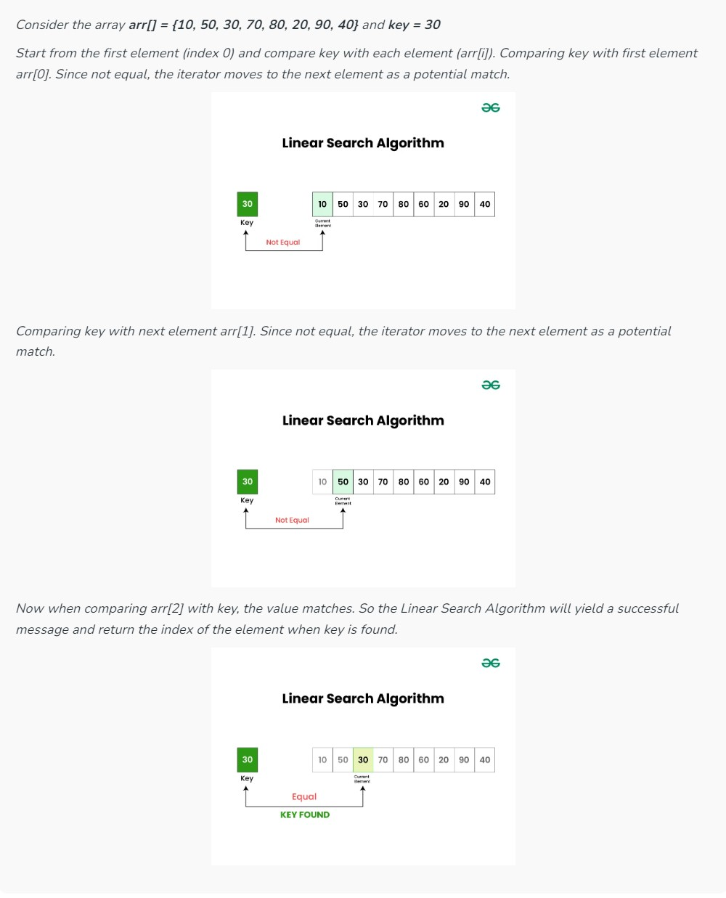

# Search Algorithms

Searching is the fundamental process of locating a specific element or item within a collection of data. This collection of data can take various forms, such as arrays, lists, trees, or other structured representations.
Introduction to Searching – Data Structure and Algorithm Tutorial
The primary objective of searching is to determine whether the desired element exists within the data, and if so, to identify its precise location or retrieve it. It plays an important role in various computational tasks and real-world applications, including information retrieval, data analysis, decision-making processes, and more.

Importance of Searching in DSA
Efficiency: Efficient searching algorithms improve program performance.
Data Retrieval: Quickly find and retrieve specific data from large datasets.
Database Systems: Enables fast querying of databases.
Problem Solving: Used in a wide range of problem-solving tasks.
Characteristics of Searching
Understanding the characteristics of searching in data structures and algorithms is crucial for designing efficient algorithms and making informed decisions about which searching technique to employ. Here, we explore key aspects and characteristics associated with searching:

1. Target Element:
   In searching, there is always a specific target element or item that you want to find within the data collection. This target could be a value, a record, a key, or any other data entity of interest.

2. Search Space:
   The search space refers to the entire collection of data within which you are looking for the target element. Depending on the data structure used, the search space may vary in size and organization.

3. Complexity:
   Searching can have different levels of complexity depending on the data structure and the algorithm used. The complexity is often measured in terms of time and space requirements.

4. Deterministic vs Non-deterministic:
   Some searching algorithms, like binary search, are deterministic, meaning they follow a clear and systematic approach. Others, such as linear search, are non-deterministic, as they may need to examine the entire search space in the worst case.

Searching Algorithms:
Searching Algorithms are designed to check for an element or retrieve an element from any data structure where it is stored.
Below are some searching algorithms:
* Linear Search
* Binary Search
* Ternary Search
* Jump Search
* Interpolation Search
* Fibonacci Search
* Exponential Search

Auxiliary space refers to the extra space or the temporary space that an algorithm uses. Space complexity is the total space taken up by the algorithm with respect to the input size. 
Space complexity includes auxiliary space as well as the space used by input. Space complexity = Auxiliary space + Input space.

## Linear Search:
   
Linear Search, also known as Sequential Search, is one of the simplest and most straightforward searching algorithms. It works by sequentially examining each element in a collection of data(array or list) until a match is found or the entire collection has been traversed.

### Algorithm of Linear Search:
The Algorithm examines each element, one by one, in the collection, treating each element as a potential match for the key you’re searching for.
If it finds any element that is exactly the same as the key you’re looking for, the search is successful, and it returns the index of key.
If it goes through all the elements and none of them matches the key, then that means “No match is Found”.

### Illustration:

### Pseudo Code for Linear Search:

* LinearSearch(collection, key):
* for each element in collection:
* if element is equal to key:
* return the index of the element
* return “Not found”

### Complexity Analysis of Linear Search:
####  Time Complexity:
* Best Case: In the best case, the key might be present at the first index. So the best case complexity is O(1)
* Worst Case: In the worst case, the key might be present at the last index i.e., opposite to the end from which the search has started in the list. So the worst-case complexity is O(N) where N is the size of the list.
* Average Case: O(N)
* Auxiliary Space: O(1) as except for the variable to iterate through the list, no other variable is used.
#### When to use Linear Search:
* When there is small collection of data.
* When data is unordered.

## Binary Search
Binary Search is defined as a searching algorithm used in a sorted array by repeatedly dividing the search interval in half. The idea of binary search is to use the information that the array is sorted and reduce the time complexity to O(log N).

### Binary Search Algorithm
* Divide the search space into two halves by finding the middle index “mid”.
* Compare the middle element of the search space with the key.
* If the key is found at middle element, the process is terminated.
* If the key is not found at middle element, choose which half will be used as the next search space.
* If the key is smaller than the middle element, then the left side is used for next search.
* If the key is larger than the middle element, then the right side is used for next search.
* This process is continued until the key is found or the total search space is exhausted.

### Illustration of Binary Search:

### Pseudo Code for Binary Search:
Below is the pseudo code for implementing binary search:
* binarySearch(collection, key):
* left = 0
* right = length(collection) – 1
* while left <= right:
* mid = (left + right) // 2
* if collection[mid] == key:
* return mid
* elif collection[mid] < key:
* left = mid + 1
* else:
* right = mid – 1
* return “Not found”

### Complexity Analysis of Binary Search:
#### Time Complexity:
* Best Case: O(1) – When the key is found at the middle element.
* Worst Case: O(log N) – When the key is not present, and the search space is continuously halved.
* Average Case: O(log N)
* Auxiliary Space: O(1)
### When to use Binary Search:
* When the data collection is monotonic (essential condition) in nature.
* When efficiency is required, specially in case of large datasets.

## Ternary Search
Computer systems use different methods to find specific data. There are various search algorithms, each better suited for certain situations. For instance, a binary search divides information into two parts, while a ternary search does the same but into three equal parts. 
It’s worth noting that ternary search is only effective for sorted data

### What is the Ternary Search?
Ternary search is a search algorithm that is used to find the position of a target value within a sorted array. 
It operates on the principle of dividing the array into three parts instead of two, as in binary search. 
The basic idea is to narrow down the search space by comparing the target value with elements at two points that divide the array into three equal parts.
* mid1 = l + (r-l)/3
* mid2 = r – (r-l)/3

### When to use Ternary Search:
* When you have a large ordered array or list and need to find the position of a specific value.
* When you need to find the maximum or minimum value of a function.
* When you need to find bitonic point in a bitonic sequence.
* When you have to evaluate a quadratic expression

### Working of Ternary Search:
The concept involves dividing the array into three equal segments and determining in which segment the key element is located. It works similarly to a binary search, with the distinction of reducing time complexity by dividing the array into three parts instead of two.  
Below are the step-by-step explanation of working of Ternary Search:

1. Initialization:
* Set two pointers, left and right, initially pointing to the first and last elements of our search space.
2. Divide the search space:
* Calculate two midpoints, mid1 and mid2, dividing the current search space into three roughly equal parts:
* mid1 = left + (right – left) / 3
* mid2 = right – (right – left) / 3
* The array is now effectively divided into [left, mid1], (mid1, mid2), and [mid2, right].
3. Comparison with Target:.
* If the target is equal to the element at mid1 or mid2, the search is successful, and the index is returned
* If the target is less than the element at mid1, update the right pointer to mid1 – 1.
* If the target is greater than the element at mid2, update the left pointer to mid2 + 1.
* If the target is between the elements at mid1 and mid2, update the left pointer to mid1 + 1 and the right pointer to mid2 – 1.
4. Repeat or Conclude:
* Repeat the process with the reduced search space until the target is found or the search space becomes empty.
* If the search space is empty and the target is not found, return a value indicating that the target is not present in the array.

### Complexity Analysis of Ternary Search:
#### Time Complexity:
* Best Case: O(1)
* Worst Case: O(log3N)
* Average Case: O(log3N)
* Auxiliary Space: O(1)

## Jump Search

Like Binary Search, Jump Search is a searching algorithm for sorted arrays. The basic idea is to check fewer elements (than linear search) by jumping ahead by fixed steps or skipping some elements in place of searching all elements.
For example, suppose we have an array arr[] of size n and a block (to be jumped) of size m. Then we search in the indexes arr[0], arr[m], arr[2m]…..arr[km], and so on. Once we find the interval (arr[km] < x < arr[(k+1)m]), we perform a linear search operation from the index km to find the element x.
Let’s consider the following array: (0, 1, 1, 2, 3, 5, 8, 13, 21, 34, 55, 89, 144, 233, 377, 610). The length of the array is 16. The Jump search will find the value of 55 with the following steps assuming that the block size to be jumped is 4.
* STEP 1: Jump from index 0 to index 4;
* STEP 2: Jump from index 4 to index 8;
* STEP 3: Jump from index 8 to index 12;
* STEP 4: Since the element at index 12 is greater than 55, we will jump back a step to come to index 8.
* STEP 5: Perform a linear search from index 8 to get the element 55.

### Performance in comparison to linear and binary search:
If we compare it with linear and binary search then it comes out then it is better than linear search but not better than binary search.
The increasing order of performance is:
* linear search  <  jump search  <  binary search
  
### What is the optimal block size to be skipped?
  In the worst case, we have to do n/m jumps, and if the last checked value is greater than the element to be searched for, we perform m-1 comparisons more for linear search. Therefore, the total number of comparisons in the worst case will be ((n/m) + m-1). The value of the function ((n/m) + m-1) will be minimum when m = ?n. Therefore, the best step size is m = ?n.

### Algorithm steps
* Jump Search is an algorithm for finding a specific value in a sorted array by jumping through certain steps in the array.
* The steps are determined by the sqrt of the length of the array.
* Here is a step-by-step algorithm for the jump search:
* Determine the step size m by taking the sqrt of the length of the array n.
* Start at the first element of the array and jump m steps until the value at that position is greater than the target value.
* Once a value greater than the target is found, perform a linear search starting from the previous step until the target is found or it is clear that the target is not in the array.
* If the target is found, return its index. If not, return -1 to indicate that the target was not found in the array.

### Time Complexity of Jump Search:
* Time Complexity: O(√n), where “n” is the number of elements in the collection. This makes it more efficient than Linear Search but generally less efficient than Binary Search for large datasets.
* Auxiliary Space: O(1), as it uses a constant amount of additional space for variables.

### Advantages of Jump Search:
1. Better than a linear search for arrays where the elements are uniformly distributed.
2. Jump search has a lower time complexity compared to a linear search for large arrays.
3. The number of steps taken in jump search is proportional to the square root of the size of the array, making it more efficient for large arrays.
4. It is easier to implement compared to other search algorithms like binary search or ternary search.
5. Jump search works well for arrays where the elements are in order and uniformly distributed, as it can jump to a closer position in the array with each iteration.

### Important points:
* Works only with sorted arrays.
* The optimal size of a block to be jumped is (? n). This makes the time complexity of Jump Search O(? n).
* The time complexity of Jump Search is between Linear Search ((O(n)) and Binary Search (O(Log n)).
* Binary Search is better than Jump Search, but Jump Search has the advantage that we traverse back only once (Binary Search may require up to O(Log n) jumps, 
consider a situation where the element to be searched is the smallest element or just bigger than the smallest). 
So, in a system where binary search is costly, we use Jump Search.

## Interpolation Search
Given a sorted array of n uniformly distributed values arr[], write a function to search for a particular element x in the array.
Linear Search finds the element in O(n) time, Jump Search takes O(? n) time and Binary Search takes O(log n) time.
The Interpolation Search is an improvement over Binary Search for instances, where the values in a sorted array are uniformly distributed. 
Interpolation constructs new data points within the range of a discrete set of known data points. 
Binary Search always goes to the middle element to check. On the other hand, interpolation search may go to different locations according to the value of the key being searched. 
For example, if the value of the key is closer to the last element, interpolation search is likely to start search toward the end side.
To find the position to be searched, it uses the following formula.

// The idea of formula is to return higher value of pos
// when element to be searched is closer to arr[hi]. And
// smaller value when closer to arr[lo]
arr[] ==> Array where elements need to be searched
x     ==> Element to be searched
lo    ==> Starting index in arr[]
hi    ==> Ending index in arr[]
      

There are many different interpolation methods and one such is known as linear interpolation. Linear interpolation takes two data points which we assume as (x1,y1) and (x2,y2) and the formula is :  at point(x,y).
This algorithm works in a way we search for a word in a dictionary. The interpolation search algorithm improves the binary search algorithm.  The formula for finding a value is: K = data-low/high-low.

K is a constant which is used to narrow the search space. In the case of binary search, the value for this constant is: K=(low+high)/2.

### The formula for pos can be derived as follows.

* Let's assume that the elements of the array are linearly distributed.
* General equation of line : y = m*x + c.
* y is the value in the array and x is its index.
* Now putting value of lo,hi and x in the equation
* arr[hi] = m*hi+c ----(1)
* arr[lo] = m*lo+c ----(2)
* x = m*pos + c     ----(3)
* m = (arr[hi] - arr[lo] )/ (hi - lo)
* subtracting eqxn (2) from (3)
* x - arr[lo] = m * (pos - lo)
* lo + (x - arr[lo])/m = pos
* pos = lo + (x - arr[lo]) *(hi - lo)/(arr[hi] - arr[lo])

### Algorithm
The rest of the Interpolation algorithm is the same except for the above partition logic.
* Step1: In a loop, calculate the value of “pos” using the probe position formula.
* Step2: If it is a match, return the index of the item, and exit.
* Step3: If the item is less than arr[pos], calculate the probe position of the left sub-array. Otherwise, calculate the same in the right sub-array.
* Step4: Repeat until a match is found or the sub-array reduces to zero.
### Time Complexity
* Time Complexity: O(log2(log2 n)) for the average case, and O(n) for the worst case
* Auxiliary Space Complexity: O(1)

## Exponential Search
The name of this searching algorithm may be misleading as it works in O(Log n) time. The name comes from the way it searches an element.
Given a sorted array, and an element x to be searched, find position of x in the array.
* Input:  arr[] = {10, 20, 40, 45, 55}
* x = 45
* Output: Element found at index 3

* Input:  arr[] = {10, 15, 25, 45, 55}
* x = 15
* Output: Element found at index 1

We have discussed, linear search, binary search for this problem.
### Exponential search involves two steps:
* Find range where element is present
* Do Binary Search in above found range.

### How to find the range where element may be present?
The idea is to start with subarray size 1, compare its last element with x, then try size 2, then 4 and so on until last element of a subarray is not greater.
Once we find an index i (after repeated doubling of i), we know that the element must be present between i/2 and i (Why i/2? because we could not find a greater value in previous iteration)

### Time Complexity
Time Complexity : O(Log n)
Auxiliary Space : The above implementation of Binary Search is recursive and requires O(Log n) space. With iterative Binary Search, we need only O(1) space.

### Applications of Exponential Search:
Exponential Binary Search is particularly useful for unbounded searches, where size of array is infinite. Please refer Unbounded Binary Search for an example.
It works better than Binary Search for bounded arrays, and also when the element to be searched is closer to the first element.
